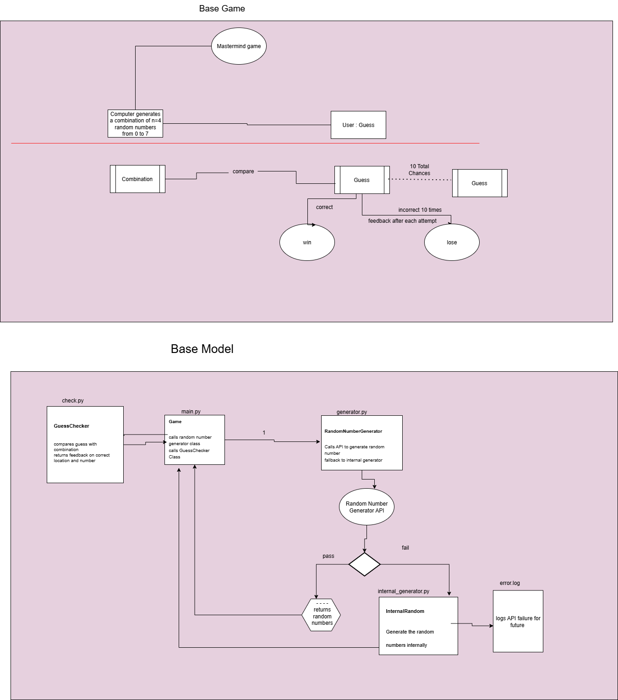
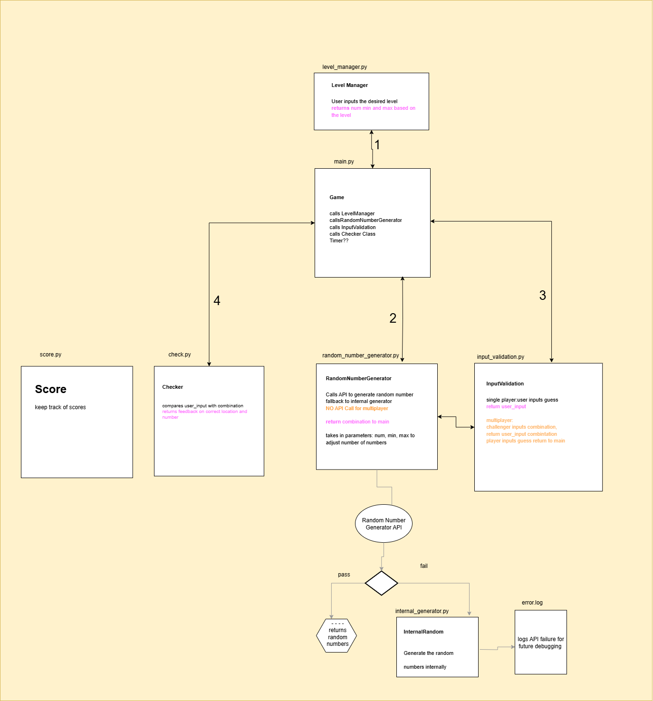
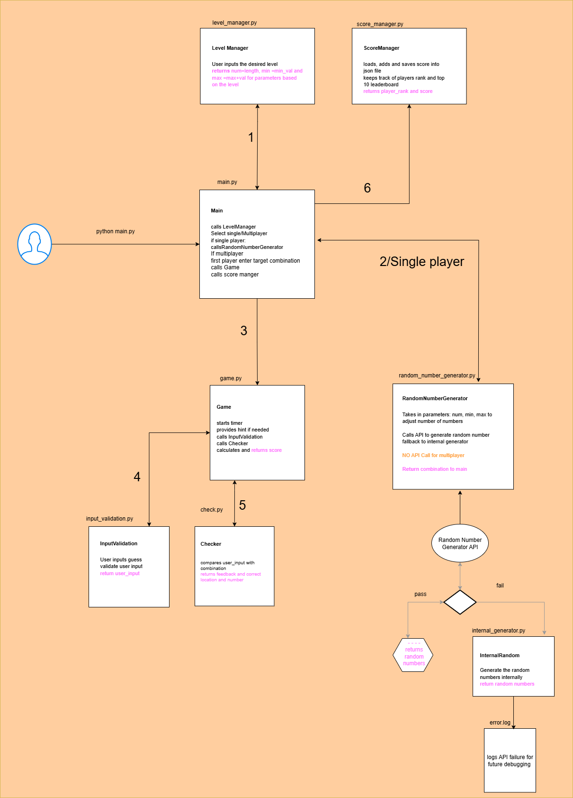

# Mastermind Game: GUESS THE NUMBERS

A number guessing game built in Python that challenges players to guess a randomly generated combination with intelligent feedback and scoring system. Also has a multiplayer mode where players can challenge each other.

## Table of Contents
- [PURPOSE](#purpose)
- [OBJECTIVES](#objectives)
- [INSTALLATION](#installation)
- [HOW TO PLAY](#how-to-play)
- [GAME MODES](#game-modes)
- [SCORING SYSTEM](#scoring-system)
- [THE STEPS TAKEN](#the-steps-taken-and-why-each-was-necessaryimportant)
- [SYSTEM DESIGN DIAGRAM](#system-design-diagram)
- [OPTIMIZATION](#optimization)
- [ISSUES & TROUBLESHOOTING](#issues-and-troubleshooting)
- [API INTEGRATION](#api-integration)
- [MONITORING & LOGGING](#monitoring--logging)
- [VERSION HISTORY](#version-history)
- [FUTURE ENHANCEMENTS](#Future-Enhancements)
- [CONCLUSION](#conclusion)

---


## PURPOSE

The purpose of the Mastermind Game is to provide an engaging number-guessing experience where players attempt to crack a code generated either by the computer or another player in multiplayer mode. The game offers a fun and interactive challenge while demonstrating how Python can be used to build a feature-rich, logic-driven application.

[Back to top](#table-of-contents)

---

## OBJECTIVES

- **10 attempts** maximum per game session
- **Time limit** per game for added challenge
- **Configurable difficulty levels** (Easy: 4 digits, Medium: 8 digits, Difficult: custom length)
- **Dynamic digit range** based on difficulty (0-7 for easy/medium, 0-9 for difficult)
- **Two Game Modes** - Single Player (vs Computer) and Local Multiplayer
- **Intelligent feedback system** providing:
  - Count of correct numbers (regardless of position)
  - Count of numbers in correct positions
  - Descriptive feedback messages
- **Strategic Hints System** - Get hints for specific positions with score penalties
- **Real-time Timer** - Complete your guesses before time runs out!

### Example Gameplay
```
Game initializes and selects "0 1 3 5"
Player guesses "2 2 4 6" → "All digits input are incorrect"
Player guesses "0 2 4 6" → "1 correct number and 1 correct location"
Player guesses "2 2 1 1" → "1 correct number and 0 correct location"
Player guesses "0 1 5 6" → "3 correct numbers and 2 correct location"
```

### User Interface Features
- Intuitive command-line interface (Flask Integration Future)
- Feedback on each guess
- Score tracking and display with hint penalties
- Remaining guesses counter
- Persistent leaderboard system
- Input validation with helpful error messages
- Multiplayer mode selection - Single Player or Two Player
- Strategic hint system - Get hints when you need them (with score cost)
- Hidden input for Player 1 in multiplayer mode (secure code entry)

---
## NEW ENHANCED FEATURES

###  Timer System
- **5-minute time limit** per game session
- **Real-time countdown** display during hint selection
- **Automatic game end** when time expires
- Time pressure adds excitement and challenge

###  Smart Hints System  
- **Position-specific hints** - Reveals one digit at a time
- **Score penalty** - Each hint costs 10 points and miss one guess
- **Progressive revelation** - Won't get the same hint twice
- **Strategic gameplay** - Balance between help and score preservation

###  Local Multiplayer Mode
- **Player vs Player** gameplay option
- **Secure code entry** - Player 1 sets code using hidden input (getpass)
- **Same difficulty settings** - Both players use selected difficulty level
- **Turn-based gameplay** - Player 1 creates, Player 2 guesses
- **Competitive scoring** - Both players can compete on the same leaderboard

###  Enhanced Game Flow
- **Mode selection** at game start - Choose Single Player or Multiplayer
- **Seamless integration** - All new features work with existing difficulty levels
- **Consistent scoring** - Same scoring system across all game modes

[Back to top](#table-of-contents)

---

## INSTALLATION

### Prerequisites
- Python 3.7 or higher
- Git (for cloning the repository)
- Internet connection (for external API, optional)

### Step 1: Install Python

#### Windows
1. **Download Python:**
   - Visit [python.org/downloads](https://www.python.org/downloads/)
   - Download the latest Python 3.x version (3.7 or higher)

2. **Install Python:**
   - Run the downloaded installer
   - ⚠️ **IMPORTANT**: Check "Add Python to PATH" during installation
   - Choose "Install Now" or customize installation as needed

3. **Verify Installation:**
   ```cmd
   python --version
   pip --version
   ```

#### macOS
1. **Option A - Using Homebrew (Recommended):**
   ```bash
   # Install Homebrew if not already installed
   /bin/bash -c "$(curl -fsSL https://raw.githubusercontent.com/Homebrew/install/HEAD/install.sh)"
   
   # Install Python
   brew install python
   ```

2. **Option B - Direct Download:**
   - Visit [python.org/downloads](https://www.python.org/downloads/)
   - Download and install the macOS installer

3. **Verify Installation:**
   ```bash
   python3 --version
   pip3 --version
   ```

#### Linux (Ubuntu/Debian)
```bash
# Update package list
sudo apt update

# Install Python and pip
sudo apt install python3 python3-pip python3-venv

# Verify installation
python3 --version
pip3 --version
```

#### Linux (CentOS/RHEL/Fedora)
```bash
# For CentOS/RHEL
sudo yum install python3 python3-pip

# For Fedora
sudo dnf install python3 python3-pip

# Verify installation
python3 --version
pip3 --version
```

### Step 2: Install Git

#### Windows
1. Download Git from [git-scm.com](https://git-scm.com/download/win)
2. Run the installer with default settings
3. Verify: `git --version` in Command Prompt

#### macOS
```bash
# Using Homebrew
brew install git

# Or use Xcode Command Line Tools
xcode-select --install
```

#### Linux
```bash
# Ubuntu/Debian
sudo apt install git

# CentOS/RHEL
sudo yum install git

# Fedora
sudo dnf install git
```

### Step 3: Clone the Repository

```bash
https://github.com/dolmagrg123/dsa.git
cd dsa
```

### Step 4: Create Virtual Environment (Recommended)

A virtual environment keeps your project dependencies isolated from system Python packages.

#### Windows

**Option 1: Using Command Prompt (Recommended for beginners)**
```cmd
# Create virtual environment
python -m venv game_env

# Activate virtual environment
game_env\Scripts\activate.bat

# You should see (game_env) in your prompt
```

**Option 2: Using PowerShell**
```powershell
# Create virtual environment
python -m venv game_env

# If you get execution policy error, run ONE of these solutions:

# SOLUTION A: Change execution policy for current session (Temporary)
Set-ExecutionPolicy -ExecutionPolicy RemoteSigned -Scope CurrentUser

# SOLUTION B: Bypass execution policy for this command only
PowerShell -ExecutionPolicy Bypass -File "game_env\Scripts\Activate.ps1"

# SOLUTION C: Use the batch file instead
game_env\Scripts\activate.bat

# Then activate normally
game_env\Scripts\activate

# You should see (game_env) in your prompt
```

#### macOS/Linux
```bash
# Create virtual environment
python3 -m venv game_env

# Activate virtual environment
source game_env/bin/activate

# You should see (game_env) in your prompt
```

### Step 5: Install Project Dependencies

With your virtual environment activated:

#### Option A: Skipping pip upgrade
```bash
# Install project dependencies directly
pip install -r requirements.txt
```

#### Option B: Upgrade pip (if needed)
```bash
# Windows - Use one of these if you get permission errors:
python -m pip install --upgrade pip --user
# OR
python -m pip install --upgrade pip --force-reinstall --no-deps

# macOS/Linux
pip install --upgrade pip

# Then install project dependencies
pip install -r requirements.txt
```

**If requirements.txt doesn't exist, manually install:**
```bash
pip install requests
```
### Step 6: Set API Key (Optional)

For optional random number generation through backup API, set your Random.org API key:

#### Windows (Command Prompt)
```cmd
set API_KEY=your_api_key_here
```

#### Windows (PowerShell)
```powershell
$env:API_KEY="your_api_key_here"
```

#### macOS/Linux (Bash/Zsh)
```bash
export API_KEY=your_api_key_here
```

#### Permanent Environment Variable Setup

**Windows:**
1. Right-click "This PC" → Properties → Advanced system settings
2. Click "Environment Variables"
3. Under "User variables", click "New"
4. Variable name: `API_KEY`
5. Variable value: `your_api_key_here`

**macOS/Linux:**
Add to your shell profile file (`~/.bashrc`, `~/.zshrc`, etc.):
```bash
echo 'export API_KEY="your_api_key_here"' >> ~/.bashrc
source ~/.bashrc
```

### Step 7: Run the Game

```bash
# Make sure your virtual environment is activated
# Windows: You should see (game_env) in prompt
# macOS/Linux: You should see (game_env) in prompt

python main.py
```

### Step 8: Deactivate Virtual Environment (When Done)

```bash
deactivate
```

---
## Troubleshooting Installation

### Common Issues

#### "Python is not recognized as an internal or external command" (Windows)
- **Solution**: Python wasn't added to PATH during installation
- **Fix**: Reinstall Python and check "Add Python to PATH"

#### "pip: command not found" (macOS/Linux)
- **Solution**: Use `pip3` instead of `pip`
- **Alternative**: `python3 -m pip install package_name`

#### Pip upgrade permission error (Windows)
- **Error**: "Access is denied" when upgrading pip

- **Solutions**:
  ```powershell
  # Method 1: Use --user flag
  python -m pip install --upgrade pip --user
  
  # Method 2: Force reinstall
  python -m pip install --upgrade pip --force-reinstall --no-deps
  
  # Method 3: Close all Python processes and try again
  # Close any Python IDEs/terminals, then retry
  ```

#### PowerShell Execution Policy Error (Windows)
- **Error**: "running scripts is disabled on this system"
- **Quick Fix**: Use Command Prompt instead of PowerShell
  ```cmd
  game_env\Scripts\activate.bat
  ```
- **PowerShell Solutions**:
  ```powershell
  # Temporary fix (recommended)
  Set-ExecutionPolicy -ExecutionPolicy RemoteSigned -Scope CurrentUser
  
  # Then activate normally
  game_env\Scripts\activate
  ```
- **Alternative**: Use the batch file version
  ```powershell
  game_env\Scripts\activate.bat
  ```

### Verification Commands

After installation, verify everything works:

```bash
# Check Python version
python --version  # Windows
python3 --version  # macOS/Linux

# Check if requests library is installed
python -c "import requests; print('Requests library installed successfully')"

# Test the game
python main.py
```

[Back to top](#table-of-contents)

---

## HOW TO PLAY

### Getting Started
1. **Run the game:** Execute `python main.py` in your terminal(Look into Installation section if it did not work)
2. **Choose game mode:** Select Single Player (vs Computer) or Multiplayer (Player vs Player)
3. **Select difficulty:** Choose Easy (4 digits), Medium (8 digits), or Difficult (custom length)
4. **Start guessing:** You have 10 attempts and 5 minutes to crack the code!

### During Gameplay
- **Enter your guess:** Type the combination when prompted
- **Get feedback:** See how many numbers are correct and in the right position
- **Use hints strategically:** Ask for hints when stuck (costs 10 points each)
- **Watch the timer:** Keep an eye on your remaining time
- **Track your score:** Points are awarded for correct numbers and positions

### Winning & Scoring
- **Guess correctly:** Match all digits in the correct positions to win
- **Bonus points:** Remaining guesses × 10 × combination length
- **Hint penalty:** Each hint costs 10 points

[Back to top](#table-of-contents)

---

## GAME MODES

###  Single Player Mode
- **Challenge the computer:** Random combinations generated via external API
- **Fallback system:** Internal random generation if API is unavailable
- **Solo challenge:** Perfect your skills and climb the leaderboard

###  Local Multiplayer Mode  
- **Player vs Player:** One player creates the code, the other guesses
- **Hidden input:** Player 1 secretly enters the target combination
- **Fair play:** Both players use the same difficulty settings
- **Competitive fun:** See who can create the most challenging codes

[Back to top](#table-of-contents)

---

## SCORING SYSTEM

### Points Awarded
- **Correct number (wrong position):** +1 point
- **Correct number (correct position):** +1 point  
- **End-game bonus:** Remaining guesses × 10 × combination length
- **Hint penalty:** -10 points per hint used

### Example Scoring (Easy Mode - 4 digits)
```
Guess 1: "1234" → 2 correct numbers, 1 correct position → +3 points
Guess 2: Used hint → -10 points  
Guess 3: "5678" → 4 correct numbers, 4 correct positions → WIN!
End bonus: 7 remaining guesses × 10 × 4 digits = +280 points
Final Score: 3 - 10 + 4 + 280 = 277 points
```

[Back to top](#table-of-contents)

---

## THE STEPS TAKEN (and why each was necessary/important)

### 1. **Dependency Management**
   ```bash
   pip install -r requirements.txt
   ```
   **Why**: Ensures consistent environment across different systems and manages external library dependencies.

### 2. **API Integration with Fallback Mechanism**
   - **Primary**: Random.org API for cryptographically secure random numbers
   - **Fallback**: Python's internal random module
   - **Logging**: Error tracking for API failures
   
   **Why**: Ensures game continuity even when external services are unavailable while maintaining audit trail for troubleshooting.

### 3. **Modular Architecture Implementation**
   - Separated concerns into distinct classes
   - Each component handles specific functionality
   - Loose coupling between modules
   
   **Why**: Improves maintainability, testability, and scalability. Makes code easier to debug and extend.

### 4. **Robust Input Validation**
   - Length verification
   - Type checking (digits only)
   - Range validation
   - User-friendly error messages
   
   **Why**: Prevents crashes and provides better user experience through clear feedback.

### 5. **Persistent Data Storage**
   - JSON-based score storage
   - Automatic leaderboard ranking
   - File-based persistence
   
   **Why**: Maintains game state across sessions and provides competitive element through leaderboards.

[Back to top](#table-of-contents)

---

## SYSTEM DESIGN DIAGRAM

Initial Base Game


Enhancement Planning


Final 



[Back to top](#table-of-contents)

---

## OPTIMIZATION

### Version 2.0 Performance Improvements

#### **Problem**: O(n²) Time Complexity
```python
# Original inefficient approach
for i in user_list:
    for j in random_list:
        if i == j:  # Nested loops = O(n²)
```

#### **Solution**: Counter-Based Algorithm O(n)
```python
from collections import Counter

# Efficient frequency-based approach
user_counts = Counter(user_guess_digits)
target_counts = Counter(target_digits)
# Single pass through data = O(n)
```

### Key Optimizations Implemented:

1. **Frequency Maps**: Using `collections.Counter` for O(n) digit matching
2. **Single-Pass Algorithm**: Eliminated nested loops
3. **Memory Efficiency**: Reduced space complexity
4. **Type Hinting**: Added comprehensive type annotations for better IDE support
5. **Comprehensive Documentation**: Enhanced maintainability with detailed docstrings

### Benefits:
- **Performance**: 90%+ improvement for large combinations
- **Scalability**: Handles combinations of any length efficiently  
- **Maintainability**: Clear, well-documented code
- **Type Safety**: Prevents runtime type errors


### Version 3.0 Performance Improvements
```python

import time
from typing import Set

# Timer-based gameplay with memory-efficient hint tracking
start_time = time.time()
hinted_positions: Set[int] = set()  # O(1) lookup for hint tracking
time_limit = 300  # 5-minute pressure gameplay

for i in range(self.length):
    if i not in self.hinted_positions:  # O(1) lookup
        self.hinted_positions.add(i)    # O(1) insertion
```
### Key Optimizations Implemented:

1. Set-Based Hint Tracking: O(1) lookup and insertion for hint positions
2. Real-time Timer Integration: Minimal performance overhead with time tracking
3. Memory-Efficient Multiplayer: Secure input without additional storage overhead
4. Optimized Game Loop: Single loop handling both timer and hint logic
5. Strategic Performance: Score penalties encourage efficient hint usage

[Back to top](#table-of-contents)
---

## ISSUES and TROUBLESHOOTING

### Issue 1: Incorrect Feedback Calculation
**Problem**: Using single loop for both position and number checking led to double counting.

```python
# Problematic approach
def check_location(user_list, random_list):
    for i in user_list:
        if i == random_list[index]:
            correct_location += 1
            correct_number += 1  # Double counting issue
        else:
            if user_list[index] in random_list:
                correct_number += 1  # Incorrect logic
```

**Example**: Random: `1127`, User: `2342` → Incorrectly reported 2 correct numbers instead of 1.

**Solution**: Implemented two-phase checking with frequency counters:
1. First pass: Check exact position matches
2. Second pass: Check remaining numbers for wrong-position matches

### Issue 2: API Endpoint Obsolescence
**Problem**: API was not providing required random integers 100% of the time
- API used: GET requests to `https://www.random.org/integers/`
- Alternate API: POST requests to `https://api.random.org/json-rpc/4/invoke`

**Solution**: 
- Can use alternate API which uses API key for better response
- Added comprehensive fallback mechanism
- Implemented detailed error logging

### Issue 3: Type Safety and Code Quality
**Problem**: Original code lacked type hints and comprehensive documentation.

**Solution**:
- Added complete type annotations
- Implemented comprehensive docstrings
- Enhanced error handling with specific exception types

[Back to top](#table-of-contents)
---

## API INTEGRATION

### Random.org Integration
```python
# API Configuration
URL = "https://www.random.org/integers/"
PARAMS = {
    "num": length,          # Number of integers
    "min": min_val,         # Minimum value
    "max": max_val,         # Maximum value
    "col": 1,              # Display columns
    "base": 10,            # Base-10 system
    "format": "plain",     # Plain text response
    "rnd": "new"          # New random sequence
}
```

### Fallback Strategy
1. **Primary**: Random.org API request
2. **Validation**: Response code and content verification
3. **Fallback**: Internal Python random generation
4. **Logging**: Error details for troubleshooting

[Back to top](#table-of-contents)
---

## MONITORING & LOGGING

### Error Logging System
- **File**: `error.log`
- **Format**: Timestamp + Error details
- **Triggers**: API failures, invalid responses
- **Purpose**: Debugging and system monitoring

### Example Log Entry:
```
API_URL ERROR: Date and Time: 2025-08-06 17:05:07.356000 
Error Code: 503
API_URL ERROR: Date and Time: 2025-08-06 17:05:53.129657 
Error Code: 503
```
Fallback: Internal generation used

[Back to top](#table-of-contents)
---

## VERSION HISTORY

### Version 3.0 (Current) - August 2025

- ✅ Timer System: 5-minute gameplay pressure with real-time countdown
- ✅ Strategic Hints: Position-specific hints with score penalties
- ✅ Local Multiplayer: Player vs Player mode with secure code entry
- ✅ Enhanced Scoring: Bonus system with hint penalties and time pressure
- ✅ Improved UX: Mode selection, timer display, and strategic gameplay
- ✅ Set-Based Optimization: O(1) hint position tracking
- ✅ Secure Input: getpass integration for hidden multiplayer setup
- ✅ Real-time Feedback: Timer integration with game loop

### Version 2.0
- ✅ Complete type hint integration
- ✅ Comprehensive docstring documentation
- ✅ Enhanced error handling
- ✅ Professional code standards compliance
- ✅ Counter-based optimization (O(n) complexity)
- ✅ Modular architecture implementation
- ✅ External API integration with fallback
- ✅ Persistent leaderboard system
- ✅ Multi-level difficulty system

### Version 1.0
- ✅ Basic game functionality
- ✅ Only one level available
- ✅ Simple feedback mechanism
- ✅ O(n^2) mechanism


---
## Future Enhancements

Web-based Interface: HTML/CSS/JavaScript frontend
Online Multiplayer: Real-time competition with remote players
Advanced Statistics: Detailed performance analytics and trends
Mobile Application: iOS/Android native apps
Database Integration: Cloud-based user profiles and global leaderboards
Tournament Mode: Bracket-style competitions with multiple players
AI Opponents: Machine learning-based computer players with adaptive difficulty

---
## CONCLUSION

The Mastermind Game  is designed to provide an engaging, scalable gaming experience that demonstrates advanced programming concepts including:
- Object-oriented design principles
- External API integration with fallback mechanisms
- Persistent data storage and leaderboard management
- Input validation and error handling
- Modular architecture for maintainability

## Contributing
Feel free to fork this repository and submit pull requests for improvements or bug fixes.

## Author
**DG** - Initial work and ongoing maintenance
- Version 1.0 - Initial Release
- Version 2.0 - Algorithm & Architecture Improvements
- Version 3.0 - Timer, Hints & Multiplayer Features - August 2025

[Back to top](#table-of-contents)


